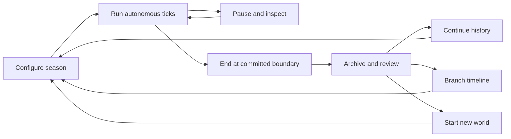

# 🌱 Mimir: Simulation Game Plan

Date: 2026-09-06  
Owner: Kevin Hozak  
Status: Design proposal informed by Kevin's answers and earlier Drive notes. No game has been implemented.  
Working folder: `C:\Projects\Philosophy-World`  
Project name: Mimir. Subtitle: A Light of Our Own.

## 1. The game in one paragraph

A small frontier society lives without waiting for a player. Its inhabitants have needs, individual histories, relationships, and competing ideas about a good life. They cooperate, misunderstand one another, form institutions, learn, thrive, and sometimes fight. Kevin observes the world over bounded seasons, then reviews what happened and chooses whether to continue its history, branch into an alternative timeline, or begin again with changed conditions. Eventually, a human can temporarily inhabit an existing character, inherit that person's circumstances, act within the same world rules, and return control to the NPC.

The first meaningful milestone is a village whose social changes Kevin can understand and care about. Population size, visual detail, and eloquent dialogue are secondary to that milestone.

## 2. Decisions and boundaries

### Confirmed by Kevin in this planning session

| Question | Direction |
|---|---|
| Primary experience | Emergent societies: beliefs, relationships, cooperation, and conflict |
| Philosophies | Fictional value systems, without declaring a winning philosophy |
| Simulation rhythm | Bounded seasons with review, continuation, branching, or reset |
| Initial setting | Fictional frontier village with shared resources and local institutions |
| NPC intelligence | Hybrid early: rules control resources/actions; AI interprets social situations |
| Human embodiment | Temporarily inhabit an existing NPC; inherit history and relationships; autonomy resumes afterward |

### Proposed defaults, open to adjustment

- Begin with 12 adult villagers, three loosely defined traditions, six locations, and one seasonal resource pressure.
- Use a 30-day simulation season with morning and evening ticks. A season is an experimental duration, not a commitment to the world's calendar lore.
- Start locally with an observer interface. Treat hosted multiplayer as a later, separate milestone.
- Use social conflict before elaborate combat: refusal, disputes, withheld cooperation, restitution, mediation, and departure.
- Keep population growth, childhood, dynasties, magic, reincarnating souls, and a continent-sized map for later extensions.
- All numerical thresholds below are proposed development gates. They are not measured results or claims about real human societies.

### Setting and AI budget decisions

- AI self-awareness remains undecided. Prototype ordinary fictional villagers and preserve an AI-aware setting as a later option.
- Kevin selected a strict small budget: proposed caps of $1 per season and $10 per month. Confirm before connecting any paid service. This planning session authorizes no API spending.

## 3. Earlier ideas recovered from Drive

The existing [Drive folder index](<C:/Projects/Agents/Manifests/My Drive Folder Index.html>) led to `Inbox/Personal/OneNote Harvest/1 - Projects/Quest`. These notes were read directly on 2026-09-06. The index is a partial folder guide dated 2026-08-30, not an exhaustive content search. Connector searches for game/simulation ideas supplemented it.

| Source | What it actually contains | How this plan uses it |
|---|---|---|
| [AI World.md](<G:/My Drive/Inbox/Personal/OneNote Harvest/1 - Projects/Quest/AI World.md>) | May 2025 notes about small towns, different philosophical themes, dice, human outsiders, and multiple interpretations of “AI” | Closest predecessor. Preserve philosophical communities and human encounters. The current embodiment decision supersedes outsider-only entry. |
| [Stoic RPG.md](<G:/My Drive/Inbox/Personal/OneNote Harvest/1 - Projects/Quest/Stoic RPG.md>) | Philosophical societies, dimensions/timelines, different problem-solving approaches, growth through mistakes, traits developing over time | Support alternative timelines, individual growth, and several viable approaches to a dilemma. Do not make Stoicism the default winner. |
| [Godot.md](<G:/My Drive/Inbox/Personal/OneNote Harvest/1 - Projects/Quest/Godot.md>) | A small town and character as initial goals, plus Godot references | Preserve the small-town scope; consider a visual client after the core loop works. Links and assets have not been evaluated for reuse. |
| [INFJ World.md](<G:/My Drive/Inbox/Personal/OneNote Harvest/1 - Projects/Quest/INFJ World.md>) | Hidden pictures/writings, treasures, spirits, and human seekers | Optional later cultural artifacts and discoveries. These are not MVP requirements. |
| [Game Dev.md](https://drive.google.com/file/d/1EeGim2r9aNVXt3BmF6iQ806jpczqdp9L/view) | Starting with a small game, learning mechanics, storytelling, and a Stoic character idea | Keep the first release small enough to finish and interesting enough to watch. |
| [AIs were left to build their own village.md](https://drive.google.com/file/d/1DtIiNn1wI-21EC5JODWNkh3YT2vnSb5z/view) | A saved summary about generative agents, memory, reflection, and social coordination | Inspiration for early hybrid interpretation and later selective reflection. It is a saved secondary summary, not proof this design will work. |

The AI World note mixes Kevin's initial ideas with a saved assistant expansion. Its long list of proposed AI identities is brainstorming, not an approved faction roster. The retrieved Open Source RPG note also contains old assistant advice; this plan does not adopt its rules or licensing claims.

## 4. The smallest interesting world

### Scenario: The First Winter

Twelve settlers share a granary, workshop, meeting place, homes, fields, and woodland. They must eat, rest, maintain shelter, and decide how much effort to put into common reserves. No character knows everybody else's motives or private inventory. A harvest shortfall creates pressure midway through the season.

Use three traditions as starting distributions of values, with variation inside every tradition:

| Provisional tradition | Strong tendencies | A productive contribution | A possible tension |
|---|---|---|---|
| Hearthkeepers | Care, obligation, continuity | Mutual aid and dependable commitments | Whose needs count, and when does duty become coercion? |
| Freehands | Autonomy, voluntary exchange, initiative | Experimentation and independence | What happens when shared work has too few volunteers? |
| Seekers | Curiosity, adaptation, long-term learning | Better methods and willingness to revise beliefs | Who bears the cost of an experiment that fails? |

These are distributions, not classes or morality labels. A caring Freehand and an ambitious Hearthkeeper should both be possible. Start without fixed rival factions. Institutions and group affiliations can emerge later from repeated choices.

### NPC state

Keep these distinct so philosophy does not become the entire personality:

- **Needs:** hunger, rest, safety, belonging.
- **Values:** care, autonomy, duty, ambition, curiosity, continuity; independent strengths rather than forced opposites.
- **Temperament:** risk tolerance, patience, sociability, openness to revision.
- **Capabilities:** a few practical skills and available time/resources.
- **Beliefs:** claims about the world, with confidence and supporting observations.
- **Relationships:** directed trust, affinity, grievance, and obligations. A may trust B while B distrusts A.
- **Memory:** observed events, who was present, and the NPC's interpretation. An interpretation can be wrong.
- **Commitments:** promises and plans with deadlines and explicit failure/cancellation outcomes.

Values guide what matters. Beliefs guide what the NPC expects. Needs create urgency. Skills limit feasibility. Relationships change how an offer is understood.

### A tick of the world

1. Advance the environment and identify available work/resources.
2. Give each NPC only the observations their location and knowledge permit.
3. Build feasible actions such as work, rest, offer food, request help, trade, refuse, or discuss.
4. Interpret selected important social events with AI; use bounded rule-based interpretation elsewhere.
5. Score feasible actions from needs, values, beliefs, relationships, costs, and risk.
6. Collect intentions from the same starting state, resolve competing claims with a seeded fair ordering, and commit validated outcomes.
7. Record events, update needs/relationships/skills, and checkpoint the completed tick.

Never let array order give one NPC permanent first access to food. Never let prose create an item, promise, injury, or relationship change without a validated event.

### What growth means

Growth is not simply wealth or becoming agreeable. NPCs may gain skills, become more reliable, revise an inaccurate belief, learn a healthier way to resolve disputes, or decide that an old allegiance no longer fits. Report these changes separately.

Begin with stable values and changing beliefs/trust. Add slow value change only after the fixed-value baseline can be explained. Repeated meaningful experiences and reflection may propose a bounded change; a single persuasive line should not rewrite a personality. Allow failed learning, mistaken inferences, and stubbornness.

## 5. Development stages and exit gates

Each stage adds one major uncertainty. If its gate fails, improve or simplify it before enlarging the world. The first three implementation stages form the initial playable observer release.

| Stage | Small deliverable | Main question | Exit gate |
|---|---|---|---|
| 0. Design bench | Six character cards; three dilemmas; hand-worked outcomes | Do values create meaningful tradeoffs? | Kevin can explain two plausible choices in each dilemma without a single obvious “correct philosophy.” |
| 1. Autonomous village | 12 NPCs, resource loop, fixed values, event log, pause/step/save | Can the village run and remain internally consistent? | Ten seeds × 60 ticks finish without invalid state; identical seed/config replay matches; save/resume matches uninterrupted execution. |
| 2. Early hybrid social interpretation | AI for selected encounters; rule-governed actions and state; memories and trust | Does AI change social understanding usefully? | Twenty reviewed encounters; no invalid state mutation; at least 16 coherent, evidence-grounded interpretations; five matched AI-on/off runs reviewed for benefit and cost. |
| 3. Season and observer MVP | Start/pause/speed controls; NPC inspector; metrics; season report; archive/continue/branch/reset | Is this worth watching and revisiting? | Three complete reviewed seasons; Kevin follows three NPCs and can trace three social changes to events; boundary and branch tests pass. |
| 4. Institutions and changing beliefs | Council/common-store rules, promises, membership, slow learning | Can cooperation and disagreement persist beyond a single encounter? | At least one sustained institution in a suitable scenario; failure/dissolution also possible; value changes have evidence; paired baseline runs show what the new mechanics changed. |
| 5. Neighboring communities and conflict | Two settlements, trade, migration, mediation, abstract injury/conflict | Do different communities create new choices? | Peaceful, negotiated, and violent test scenarios all resolve coherently; conflict has resource/social costs; settlement extinction remains inspectable. |
| 6. Human incarnation, private pilot | One human inhabits an eligible NPC through the common command system | Does a human belong inside this world? | Entry/exit/reconnect tests pass; no duplicate control or resources; a relationship consequence persists after NPC autonomy resumes. |
| 7. Small shared-world alpha | 2–5 invited players, authoritative server, timed turns, operational controls | Can humans coexist with autonomous continuity? | Full scheduled season plus restart/reconnect/recovery exercise; scoped roles, action limits, and operating budget hold. |

### Stage 0: one focused design session

Write six distinct villagers, including two from each tradition. Walk through: a hungry neighbor asks for a loan; a common repair competes with private work; somebody breaks a promise for a defensible reason. Record actions, likely interpretations, and uncertainties. Do not prewrite the season's outcome.

### Stage 1: a deliberately short foundation

Deliver a runnable command-line or minimal local control panel with a 60-tick season and a readable timeline. It must already contain autonomous resource choices and differing values. Use template descriptions. This is a prerequisite for the requested hybrid design, not a decision to postpone AI indefinitely.

Fixtures: abundant harvest, tight harvest, impossible shortage, and two agents claiming the same resource. Invariants include finite bounded values, unique IDs, nonnegative inventory, valid locations, and resource changes accounted for by production, consumption, transfer, or loss. Preserve a shortage outcome if it follows the rules; correct accounting errors instead of hiding them.

### Stage 2: AI enters the actual social loop

Trigger AI on ambiguity: an unexpected refusal, broken promise, disputed intention, or consequential offer. Supply a short character profile, current observations, and a few relevant memories. Ask for a structured interpretation with evidence IDs, uncertainty, and a proposed social response from an allowed list.

Example: “They refused to share because they distrust me” is a belief hypothesis; “they transferred two food” is a world event and can only come from the engine. An interpretation may influence the next action score and a bounded trust update. That makes AI consequential without surrendering authority over the world.

Test unknown facts, nonexistent event references, unsupported actions, contradictory claims, malformed output, timeout, and budget exhaustion. Invalid responses use a logged fallback. Record whether each outcome used AI or fallback; otherwise comparisons become misleading.

### Stage 3: the first satisfying release

The observer sees a simple location view, chronological events, resource trends, relationships, and an inspector answering “what does this person believe, and why?” Click a claim to see its supporting event or recognize that it is uncertain. Separate objective events from NPC interpretations.

Complete the season even when Kevin closes the viewer, as long as the simulation process remains running. Closing the process pauses local time at the last committed checkpoint; a local prototype is not an always-on service. No automatic offline catch-up initially.

### Stages 4–5: deepen society before scaling it

Start with one institution: a shared-store agreement. Define contribution rules, membership, benefits, dissent, enforcement, and exit. Council decisions must affect resource rules. Promises must create trackable commitments. Avoid decorative politics that only produces dialogue.

Add a neighboring settlement only after this works. Give communities different starting tendencies without making all members identical. Initially resolve violence abstractly through contest, retreat, injury, and negotiated aftermath. Theft, coercion, and fighting must compete with trade, avoidance, restitution, and mediation as feasible options. Do not script a mandatory war to make a season exciting.

### Stages 6–7: humans become participants

First pilot uses discrete action choices and bounded dialogue, not unrestricted physical movement. The human receives the inhabited NPC's knowledge, relationships, inventory, promises, and recent memories. Observer-only information is hidden in player mode.

Acquire an exclusive controller lease at a tick boundary. While leased, the NPC planner does not submit competing decisions. On exit, timeout, or disconnect, release the lease and resume autonomy at the next boundary using the updated history. A small grace period can be configured for reconnects.

Human commands consume the same time/resources and pass the same validation as NPC commands. The human can act against the character's preferences, but preferences are not silently overwritten. Other NPCs react to the character's observable actions. Unexpected behavior becomes part of the history.

Test two users claiming one NPC, repeated requests, stale commands, disconnect mid-tick, season end while inhabited, and character incapacitation. Start with fixed command deadlines for multiplayer; the world advances without waiting forever for an absent player. Hosted persistence is an explicit deployment milestone, not a property of the early desktop build.

## 6. In-world seasons, pauses, and alternative timelines

Development stages above describe what gets built. Seasons describe how an implemented world runs.



| Operation | Meaning | Preserve |
|---|---|---|
| Pause/resume | Stop after a committed tick, then continue | World, random-generator state, pending commitments, AI records |
| Continue | Start the next season in the same world | People, memories, relationships, institutions, resources, history |
| Branch | Create a new timeline from a checkpoint | Parent reference and an immutable parent snapshot; record all changed conditions |
| Reset | Create a new world from a scenario | Prior world's archive; carry no relationships or items by accident |
| Replay | Reproduce the historical run | Same rules/configuration, commands, random state, and recorded AI decisions |

Hard stop: scheduled tick limit, manual stop, or engine failure. Stop after the last fully committed tick; never save half an exchange. Resource collapse ends or pauses a run according to its scenario policy and generates a report. No NPC behavior is guaranteed to prevent collapse.

At each review, Kevin chooses one research question and normally changes one major condition. Examples: “What if reserves were voluntary?” or “What if trust recovered more slowly?” A branch with different rules is a new experiment, not a replay of the original.

Freeze mechanics within a season for interpretable experiments. If an emergency rule change is necessary, checkpoint and label a branch or record an explicit intervention. Never rewrite the archived event history. New code must declare snapshot compatibility; unsupported migrations create a fresh world or retain the old engine version for viewing/replay.

## 7. Practical architecture

Start with one local simulation process, not a fleet of independently deployed NPC services. Separate the simulation core, AI adapter, persistence, and viewer through clear interfaces. The initial language and visual engine remain an implementation decision; this plan does not commit to rewriting the existing Godot or u6ish projects.

| Component | Responsibility |
|---|---|
| Simulation core | Clock, world state, feasible actions, resolution, needs, learning rules |
| AI interpretation adapter | Bounded context, structured proposals, validation, timeout/fallback, usage tracking |
| Event and checkpoint store | Committed outcomes, state snapshots, seeds, version IDs, commands, run lineage |
| Observer interface | World inspection, playback, controls, comparisons; no direct state mutation |
| Player command interface | Scoped knowledge and validated actions; same engine path as NPCs |
| Season controller | Lifecycle, tick limits, archive, continuation, branching, configuration validation |

A checkpoint must include world and NPC state, next tick, RNG state, pending plans, controller ownership, schema/rules versions, scenario/config hash, and last committed event ID. Log human commands and validated AI results with their context hashes, model identifier, prompt version, and outcome. Keep inference hypotheses separate from canonical facts.

Re-running a live AI request is not guaranteed to reproduce its answer, even with the same seed. Exact historical replay uses recorded validated results. New live AI calls produce a fresh run; compare it statistically instead of claiming exact replay. An AI timeout must not stall the entire season indefinitely.

### AI operating controls

- Use event-triggered interpretation, not an API call for every NPC every tick.
- Start with a proposed maximum of four AI requests per tick and 120 per season; reserve part of that allowance for reflection. Tune after measuring quality and cost.
- Cap input/output tokens, concurrent requests, and retries. Start with zero automatic retries and a finite timeout such as ten seconds.
- Reserve each call's worst-case estimated cost before dispatch, including any allowed retries; enforce both per-season and monthly limits. Account for in-flight calls.
- Cache by complete context plus prompt/model version. A changed memory or world observation invalidates the cache key.
- On cap exhaustion, finish the season using recorded rule-based fallback and mark the change clearly in the report.
- Treat dialogue and player text as untrusted world content. NPC model calls receive no shell, filesystem, administrative tools, or other characters' hidden memories.

Cost worksheet: `estimated spend = requests × ((average input tokens × input price per million + average output tokens × output price per million) / 1,000,000)`. Substitute measured tokens and verified provider prices when selecting a model. No provider or price is assumed here.

The memory/reflection direction has a relevant research precedent: Park et al.'s [Generative Agents](https://arxiv.org/abs/2304.03442) describes a 25-agent sandbox using observations, retrieval, reflection, and planning. This supports investigating that architecture; it does not establish that generated behavior accurately models real societies. The deterministic engine boundary, staged gates, and budgets here are project design proposals.

## 8. How to tell whether the simulation works

### Measure several kinds of thriving

| Dimension | Initial observable measure |
|---|---|
| Material wellbeing | Unmet-need ticks per NPC; food reserves; shelter condition |
| Distribution | Lowest-quartile resources and unmet needs, alongside averages |
| Cooperation | Completed joint work and fulfilled promises, with opportunity counts |
| Relationships | Trust trajectories, isolation, repair after grievances |
| Conflict | Disputes, coercion, injuries, mediation, settlements; normalize by population/time |
| Agency | Feasible choices available, voluntary departures, unmet personal goals |
| Growth | Skills learned, beliefs revised with evidence, bounded value changes |
| Culture | Distribution of values and affiliations; minority survival and membership changes |
| Experience | Can Kevin recognize characters, explain surprises, and want to follow another season? |

Avoid a single “best society” score. Peace may coexist with coercion; high output may conceal deprivation. Report tradeoffs and individual cases. A game model's results expose the consequences of its assumptions, not the truth of a philosophy.

### Experiment suite

1. **Abundance baseline:** Does cooperation or disagreement still exist without forced starvation?
2. **Scarcity:** Do allocation choices and trust matter? Is collapse caused by mechanics or a bug?
3. **Promise breach:** Can agents distinguish inability, misunderstanding, and exploitation within their knowledge?
4. **Information gap:** Can an NPC form and later correct a mistaken interpretation without learning hidden facts?
5. **Learning off/on:** Does adaptation add interpretable change rather than instant conformity?
6. **AI off/on:** Does semantic interpretation alter plausible choices, beyond prettier narration?
7. **Values neutralized:** Do otherwise matched agents behave differently when value weights are flattened?
8. **Human arrival and departure:** Does the world's causal continuity survive a change in controller?

Use a fixed published seed set for regression and a separate unseen set for exploration. For early balance comparisons, use at least ten matched seeds and show ranges plus representative histories. Preserve the exogenous event schedule across branches when possible; action-dependent random draws can otherwise confound comparisons. Small samples guide iteration and do not prove general conclusions.

## 9. First implementation backlog

Keep only three active work packages at a time:

### A. Define and prove the village loop

- [ ] Finalize the six sample characters and three dilemmas.
- [ ] Specify the twelve-villager scenario and initial resource accounting.
- [ ] Implement clock, observations, feasible actions, seeded resolution, event log, and save/resume.
- [ ] Pass stage 1 invariants and inspect shortage outcomes.

### B. Make hybrid social encounters meaningful

- [ ] Define the interpretation schema and evidence/knowledge validation.
- [ ] Implement the model adapter with timeout, budget reservation, and fallback.
- [ ] Connect interpretations to bounded belief/trust updates and next-action scoring.
- [ ] Run the twenty-encounter review and AI-on/off comparisons.

### C. Deliver one complete observer season

- [ ] Build the timeline, NPC inspector, and basic location/relationship views.
- [ ] Implement archive, continue, branch, and reset without overwriting runs.
- [ ] Generate a report and play through three review cycles with Kevin.
- [ ] Decide whether to deepen institutions, improve readability, or simplify behavior.

Stage 0 can fit one design session. Stages 1–3 should be estimated after the first executable slice, when implementation speed and AI latency are known. Use the exit gates rather than promising a release date before those uncertainties are measured. If the village is uninteresting, revise decisions, information, and consequences before increasing the population.

## 10. Season review template

```text
World / timeline / season:
Parent checkpoint, if branched:
Rules version / scenario / seed:
Question tested and expected observation:
Change from previous run:
AI model / prompt version / calls / tokens / cost / fallback count:
Completed ticks and stop reason:

Three consequential events, with event IDs:
Three characters worth following:
Cooperation, conflict, and distribution of wellbeing:
Belief or value changes and their evidence:
Unexpected behavior: bug, intended tradeoff, or unresolved?
What the data does NOT establish:

Decision: continue / branch / reset / repair first
One proposed change for the next experiment:
Archive and checkpoint references:
```

## 11. Later possibilities, preserved without enlarging the MVP

- Several settlements with different traditions, dissent, alliances, and migration.
- Institutions that preserve oral history, art, rituals, and inherited mistakes.
- Hidden writings or artifacts inspired by INFJ World, introduced as fictional content before user contributions.
- An AI-aware setting using the Advanced / Another / Amorphous Intelligence ideas if Kevin selects that direction.
- Generations and cultural inheritance after individual learning is understandable.
- Soul continuity or reincarnation as a separate mode, if requested later. Temporary NPC embodiment does not require it.
- A visual town client informed by the older Godot work, evaluated after the observer MVP.

Next planning checkpoint: after the six-character dilemma exercise and first runnable village. Review whether different values actually matter, whether Kevin wants to follow the people, and whether the hybrid layer adds enough to justify its complexity.
