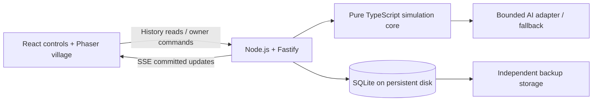

# 🌍 Philosophy World: Web Development Plan

Date: 2026-09-06  
Status: Implementation recommendation; no application has been built or deployed.  
Companion design: [Simulation Game Plan](2026-09-06_Simulation_Game_Plan.md)

## 1. Recommended direction

Build a **TypeScript web application with Phaser for the animated village, React for the controls and inspector, and a Node.js server that owns the simulation**. Store the world's history in SQLite on persistent server storage. Start with one small paid hosting service and one shared world.

This gives us a pleasant browser experience without committing to a 3D production pipeline. The most important early demonstration is simple: open the website, watch recognizable villagers move between activities, click someone to understand their situation, rewind to an earlier day, play the history, and press **Return to Live**.

### Confirmed direction

- Cozy 2D top-down village with animated sprites.
- One shared world running on a server even when the website is closed.
- Hosting target of approximately **$5–15 per month**, separate from AI spending.
- A god-eye view, visible NPC movement, current progress, historical playback, and return to live.
- Attractive and readable initial graphics; elaborate visual polish can follow.

This updates the original plan's local-first viewer and later visual-client proposals: the animated web viewer is now an early deliverable, and hosted autonomous operation is part of the observer MVP. The original social simulation, hybrid AI, 12 adult villagers, six locations, and bounded seasons remain the design foundation.

**Proposed defaults:** desktop/laptop first, a responsive tablet layout, public read-only viewing, and owner-only world controls. These are recommendations rather than answers already supplied by Kevin. Phone viewing should remain usable, with the inspector below the map, but is not the initial visual acceptance target.

## 2. Language and tools

| Area | Recommendation | Reason for this project |
|---|---|---|
| Main language | TypeScript in browser, server, and simulation | Shared types for people, events, snapshots, and commands; one language to maintain |
| Animated world | Phaser | A 2D game framework with sprites, animation, cameras, and tilemap support; suitable for the browser village |
| Website interface | React + ordinary CSS | Timeline, NPC details, menus, accessible controls, and responsive layout |
| Frontend tooling | Vite | Straightforward local development and a static production build |
| Server | Node.js supported LTS + Fastify | One persistent process serving the site, history API, live updates, and simulation scheduler |
| Validation | TypeBox / JSON Schema with Fastify | Validate API inputs and structured AI proposals at runtime; TypeScript types alone cannot validate external data |
| Persistence | SQLite, SQL migrations, a maintained Node SQLite driver | Enough for one world and one writing process, without paying for a separate database service |
| Live delivery | Server-Sent Events (SSE), plus HTTP requests | Server pushes committed updates; viewer and owner commands use normal HTTP |
| Map authoring | Tiled | Visually place terrain, buildings, paths, and named location anchors; export JSON |
| Art | One coherent licensed tileset and compatible character sprites | Consistency delivers more value than individually impressive but mismatched assets |
| Verification | Vitest for engine tests; Playwright for browser flows | Prove accounting, saved history, and the rewind-to-live experience |
| Development workflow | npm workspaces, Git, lockfile, formatter/linter | Keep related packages together without a complex build system |
| Hosting | Render paid web service with persistent disk, subject to a current quote | A concrete candidate for one small persistent server; serve the frontend from that same service |

Phaser supports JavaScript/TypeScript development and browser rendering; Vite documents React/TypeScript scaffolding. These capabilities support the recommendation, while the choice to combine them is project-specific. See [Phaser installation](https://docs.phaser.io/phaser/getting-started/installation), [Phaser introductory game tutorial](https://docs.phaser.io/phaser/getting-started/making-your-first-phaser-game), and [Vite guide](https://vite.dev/guide/).

Fastify provides schema validation and TypeScript support. SQLite is appropriate for this small single-server workload; its single-writer constraint should remain an explicit deployment boundary. See [Fastify](https://fastify.dev/) and [SQLite appropriate uses](https://www.sqlite.org/whentouse.html).

### Alternatives considered

| Alternative | Assessment |
|---|---|
| PixiJS | Good rendering-focused alternative, but Phaser supplies more of the camera, animation, and tilemap framework this village needs |
| Godot / GDScript | Worth revisiting for an editor-driven game or richer gameplay; the browser inspector, history API, and persistent server would still require work |
| Three.js / 3D | Adds models, lighting, camera, and animation production effort beyond the requested first view |
| Python server + TypeScript viewer | Viable if later scientific tooling requires Python; currently adds a second language and duplicated data contracts |
| Next.js | Unnecessary for this first interactive observer; the project does not currently need server-rendered content pages |
| PostgreSQL | Upgrade when multiple server processes, heavier queries, or hosted multiplayer justify a separate database |

Choose compatible stable versions at implementation time and commit the lockfile. Do not tie this plan to an unverified latest version number.

## 3. What the first website looks like

The village occupies most of the screen. A compact top bar shows the world, season, day, morning/evening, food reserve, population, and connection status. The bottom timeline remains visible. Selecting a villager opens a side panel.

```text
Philosophy World     Season 1 · Day 8 · Morning      LIVE · Connected
┌───────────────────────────────────┬───────────────────────────┐
│                                   │ Selected villager         │
│  Fields      Homes      Woodland  │ Name · current activity   │
│       paths and moving villagers  │ Needs and resources       │
│  Granary    Meeting place         │ Beliefs and relationships │
│                 Workshop          │ Why? → supporting events  │
│                                   │                           │
├───────────────────────────────────┴───────────────────────────┤
│ Recent events · filter by person / location / event type      │
│ Day 1 ───────────●────────────────────────────────── Day 30   │
│ Previous tick   Play history   1× / 2× / 4×   Return to Live   │
└───────────────────────────────────────────────────────────────┘
```

### Initial visual scope

- One handcrafted map, approximately 48 × 48 tiles, with the six scenario locations.
- Warm, restrained palette, clear paths, readable building silhouettes, and simple shadows.
- Current visual direction: an original, warm top-down village illustration with readable terrain, distinct character sprites, earthy colors, simple shadows, and visible tile-based movement. Keep the scene inviting and legible rather than targeting a specific retro game's look.
- Do not copy another game's assets, maps, characters, or exact artwork. All project art must have a documented source and license.
- Twelve distinguishable villagers using clothing/hair variations and names on selection or hover.
- Short directional walking loops, idle poses, and small work/rest/conversation indicators.
- Camera pan, zoom, fit-village button, click-to-select, and optional follow-selected-NPC.
- A subtle morning/evening tint and selected-character highlight.
- Optional relationship overlay shown for the selected person, avoiding a permanent web of lines.
- A searchable NPC list as an alternative to clicking small sprites. Labels and icons supplement color.
- Reduced-motion mode removes decorative movement and uses direct or minimal position transitions.

Use one licensed asset family initially, or commission/create an original asset family that follows the visual target above. Keep source files and a credits/license manifest with every asset's origin and redistribution requirements. Tiled supplies a free open-source map editor with layers and JSON export; see [Tiled](https://www.mapeditor.org/). Custom portraits, interiors, weather, elaborate effects, and audio can wait.

## 4. Simulation time and visible movement

Keep three clocks distinct:

1. **World time:** the original morning/evening decision ticks, 60 ticks per 30-day season.
2. **Server pace:** how frequently the server computes another tick in wall-clock time.
3. **Viewer playback time:** how quickly one browser presents recorded ticks and movement.

Propose one world tick every 15 seconds initially, so a season takes roughly 15 minutes plus computation delays. This is a tuning default, not a promised duration. A season ends at its configured boundary and waits for owner review; server hosting does not automatically authorize endless new seasons.

The engine chooses destinations and activities. For the MVP, travel is resolved within a decision tick using a shared walkable map and fixed route ordering. Record each NPC's route and activity sequence with that tick. The browser animates the committed transition along those routes, then shows the activity pose. Animation must not invent meetings, transfers, or decisions.

This is a visual representation of coarse simulation time. Exact mid-walk physical interactions are outside the first version. In the inspector, state changes occur at tick boundaries; the timeline may scrub within a transition for movement, but must identify the associated committed tick rather than imply sub-tick resource precision.

Render smoothly using elapsed frame time, aiming for 60 FPS and accepting 30 FPS on the initial reference laptop. React updates panels when state changes; Phaser owns per-frame sprite movement. Keep the Phaser canvas and villager containers mounted between ticks, retargeting existing containers through committed routes one tile at a time. Do not rerender the React tree on every animation frame.

Live animation presents the latest committed transition, so it can briefly trail the authoritative head. Label the displayed tick and latest committed tick. If a viewer falls behind, skip older visual transitions and resynchronize rather than accumulate an unbounded animation queue. World rules never depend on browser frame rate.

## 5. Replay and Return to Live

**Historical viewing never rewinds or pauses the shared world.** Each browser has its own viewing position.

| Mode/action | Behavior |
|---|---|
| Live | Follow committed server updates and animate the latest transition |
| Scrub backward | Enter History mode and load the chosen tick; server continues |
| Play history | Animate recorded transitions at the viewer's selected speed |
| Pause history | Freeze this viewer only |
| Previous/next tick | Move to a precise historical state |
| Return to Live | Cancel replay loading/animation, fetch a fresh head snapshot, and resume updates |
| Disconnected | Preserve the last loaded view and show that it is stale; never label it current live state |
| Season complete | Show the latest state with a season-complete label; archive remains playable |

In History mode show both times, for example: **Viewing Day 3 evening · Live world at Day 9 morning**. The inspector, event list, and charts must all use the selected historical state. Future beliefs and events must not leak into an earlier view.

Keep a lightweight live-head indicator updated while browsing history. Reaching the current replay boundary pauses history and offers Return to Live; it does not silently switch modes. At launch, latest history means the currently selected timeline, not whichever branch ran most recently.

For race-free Return to Live, fetch a snapshot carrying its committed sequence number, then subscribe after that sequence. The server replays any intervening commits. Ignore duplicates, detect gaps, and refetch if necessary. Tag seek requests so a slow response for an older slider position cannot overwrite a newer selection. Limit cached history and cancel obsolete requests.

### Save state instead of regenerating the past

For only 12 villagers and 60 ticks, **save a complete checkpoint after every tick**, plus the initial state, narrative events, validated AI results, and visual routes. This is simpler than reconstructing history from a sparse checkpoint and a complex event reducer. Measure storage before expanding; full snapshots containing growing memories will eventually need compression or a different retention strategy.

Historical viewing loads those saved states and transitions. It makes no AI calls and does not require old engine code to recompute decisions. Preserve schema-compatible readers and versioned map/sprite assets so archived seasons remain viewable.

Keep deterministic engine re-execution as a separate testing capability: identical configuration, recorded commands/AI decisions, engine version, and random-generator state should reproduce the saved state hashes. A changed-rule branch is a new experiment, never an overwrite of history.

## 6. Server and persistence architecture



Use one server process and one simulation writer initially. The pure engine has no dependency on Phaser, React, HTTP, or the database. Its inputs are prior state, configuration, seeded randomness, and validated decisions; outputs are next state and recorded outcomes.

Do not hold a database transaction open while waiting for AI. Compute a candidate tick with bounded AI timeouts, then atomically commit its checkpoint, events, decisions, routes, state hash, and new head pointer. Publish only after commit succeeds. Use a single-flight scheduler and reject a commit if the stored head no longer matches the tick's starting state.

After a crash, load the last committed checkpoint. A paid AI call from an interrupted, uncommitted tick may already have incurred cost: persist budget reservations before dispatch and conservatively reconcile unresolved calls after restart. Tick rollback must not reset spending records.

### Initial stored records

| Record | Required contents |
|---|---|
| World/timeline | ID, parent checkpoint if branched, scenario, seed, configuration hash, versions |
| Season | Timeline, start/end ticks, pace, status, stop reason |
| Tick checkpoint | Full world/NPC state, next tick, RNG state, pending plans, event cursor, state hash |
| Events | Stable IDs, tick/order, participants, location, factual outcome or explicitly labeled interpretation |
| Visual transition | NPC, tick, ordered path, activity phases, presentation/map version |
| AI decision | Context hash, model/prompt version, validated result or fallback, usage and cost reservation |
| Owner command | Request ID, actor, expected tick, command, acceptance/rejection and outcome |

Key all history by timeline and tick; enforce uniqueness. Include lineage, controller state, and compatibility fields required by the original design. Use bounded history pages rather than returning the whole archive on every request.

Suggested HTTP surface: world summary/head; state at tick; paginated events; transition ranges; live stream after sequence; authenticated owner commands. Owner commands are idempotent and applied at tick boundaries. Validate authorization on the server, including branch, reset, speed, and pause operations.

Public god-eye observation can reveal fictional NPC beliefs intentionally. Future embodiment must have a separate server-filtered response; hiding observer data in the browser is insufficient. AI secrets remain server-side.

## 7. Hosting and cost

Start with a **single paid Render web service and persistent disk**, hosting both the built website and Node API/scheduler. This avoids a second application deployment and database service for the first shared village. Configure one instance; SQLite should remain on its attached local persistent disk.

Render supports disks on paid services. Disk-backed services have deployment limitations, including interruption during deploys; this is acceptable for the prototype if restart recovery works. See [persistent disks](https://render.com/docs/disks) and [deploy behavior](https://render.com/docs/deploys).

Treat **$5–15/month as the user's target, not a verified provider quote**. Before deployment, price the smallest suitable paid compute instance, disk, independent backups, and expected bandwidth together using [Render pricing](https://render.com/pricing). If the total exceeds the target, revisit the host or capacity with Kevin before provisioning. Use the provided host subdomain initially; a custom domain is optional and extra. No hosting or paid API has been provisioned by this document.

Do not select Render's free web service for unattended simulation: it sleeps after inactivity and cannot attach persistent disks. Its free PostgreSQL also expires after 30 days. These constraints make it unsuitable as this world's durable hosting plan. See [Render free-service limitations](https://render.com/docs/free).

Operations required for the hosted MVP:

- Automatic process restart; health response includes run status and last committed tick.
- Resume from the last committed state after restart, with no automatic offline catch-up.
- Back up using a SQLite-safe backup mechanism to storage independent of the attached disk; test restoration. Include asset/version references.
- Propose daily backups plus season-boundary backups, with seven daily copies and retained season archives; measure and review storage use.
- Preserve active and archived history initially. Do not silently prune old seasons when storage fills; alert the owner and stop safely before writes fail.
- Structured error logs and visibility into last tick, AI timeouts, fallback count, storage, and costs.
- Graceful shutdown: finish or abandon the candidate tick safely before process exit.

The local hardening slice now exercises the same boundaries before hosting: timeline-aware checkpoint/event storage with migration from the original tables; owner endpoints for archive, continue, branch, reset, pause, and tick; `/api/report` operational counts; `OWNER_TOKEN` enforcement when configured; clean SIGINT/SIGTERM shutdown; and the workspace backup tool. Use `DATABASE_PATH=<path> npm run backup --workspace @philosophy-world/server -- backup <destination>` and the corresponding `restore <backup> <destination>` command. Restore refuses to overwrite an existing target.

AI keeps the original proposed **$1 per season and $10 per month caps**, with authorization required before connecting a paid provider. Start development with deterministic fixtures and a rule-based fallback. The intended hybrid layer remains in the MVP, subject to that spending decision; if unavailable, label the release as rules-only rather than claiming hybrid completion.

## 8. Implementation sequence

Build a visible slice early, then replace sample motion with actual outcomes. Keep at most three active work packages, as requested by the original design.

| Milestone | Deliverable | Acceptance gate |
|---|---|---|
| 1. Visual browser prototype | Map, 12 sprites, routes, pan/zoom, inspector shell | Kevin can identify villagers and finds the village readable; sample behavior is clearly labeled |
| 2. Real village and storage | Original stage-1 engine, 60 ticks, full checkpoints, events, actual destinations | Ten seeds pass accounting/invariant checks; save/resume matches uninterrupted execution |
| 3. Rewindable observer | Historical slider, playback speeds, tick stepping, synchronized inspector/charts, Return to Live | Recorded states match inspected ticks; multiple viewers can watch different times without changing the world |
| 4. Hybrid social layer | Original stage-2 interpretations, evidence, trust/belief effects, budget/fallback controls | Original twenty-encounter and AI-on/off gates pass; historical playback triggers zero AI calls |
| 5. Hosted observer MVP | Paid server, persistence, owner controls, archive/continue/branch/reset, reports | Browser closure does not stop a running season; restart, backup restore, replay, and three season reviews pass |

The first useful demonstration is milestones 1–3: a real animated village with replay. Milestones 4–5 complete the intended hosted hybrid observer release. Estimate calendar time after milestone 1 establishes asset and integration effort; avoid a deadline unsupported by implementation evidence.

### Current implementation status

- Phases 1–3 have a working browser slice: the illustrated village, twelve selectable villagers, route animation, contained map zoom, playback-rate controls, live SSE updates, historical checkpoints, timeline scrubbing, and manual tick stepping.
- Phase 2 verification covers ten deterministic seeds, distinct destination occupancy, bounded resources, and equivalence between uninterrupted and resumed execution.
- Phase 4 now has a deterministic social adapter. It records evidence-linked interpretations with source, confidence, belief category, and trust delta; the server stores them separately and the observer shows them alongside objective events.
- The active default is **rules-only**. `AI_ENABLED=true` with a positive `SOCIAL_BUDGET_CENTS` exposes an explicit `ai-fallback` configuration state, but no paid provider is connected until a provider, model, and spending authorization are separately approved. Historical playback reads persisted interpretations and makes no AI request.

### Proposed repository layout

```text
apps/web/                 React interface and Phaser scenes
apps/server/              API, scheduler, persistence, AI adapter
packages/simulation/      Pure engine, scenario rules, deterministic tests
packages/contracts/       Shared schemas and transport types
assets/source/            Editable maps and asset source material
assets/licenses/          Attribution and license manifest
scenarios/                First Winter configuration and fixtures
tests/e2e/                Browser replay/live and owner-control flows
docs/                     Architecture decisions and operating guide
```

Retain the existing root design plan and this document. Runtime databases and secrets belong outside tracked source files. Initialize version control during implementation if the folder is still unversioned.

## 9. Verification that matters

In addition to the original simulation and social-quality gates:

- Seek to the beginning, middle, and final tick; compare all panels with the recorded checkpoint.
- Jump from history to live while a tick commits; verify no missing or duplicate update.
- Rapidly scrub several times; verify late responses cannot change the selected time.
- Disconnect/reconnect during replay and live viewing; stale state must be labeled.
- Open two browsers, rewind one, and confirm the other continues receiving live updates.
- Close every browser and confirm server ticks continue until the season boundary.
- Restart between ticks and interrupt an uncommitted tick; recover without half-transfers or duplicate ticks.
- Restore an independent backup and open its historical village using preserved asset versions.
- Attempt owner actions as an anonymous viewer; verify server rejection.
- Branch at a checkpoint, change one condition, and verify the parent history remains identical.
- Profile the actual 12-NPC scene. Proposed targets: at least 30 FPS, cached seeks under 200 ms, and uncached seeks under one second on the chosen test setup. Record device/network conditions; these are targets, not measurements.

Use [Playwright](https://playwright.dev/docs/intro) for interaction flows and real visual inspection for sprite legibility, motion, and layout. A passing browser test alone does not establish that the village looks pleasant.

## 10. Deferred scope

Defer 3D, large populations, procedural continents, multiplayer embodiment, collision-driven combat, elaborate interiors, and automatic season continuation. Preserve their architectural paths through an authoritative engine, shared command validation, immutable history, and explicit timeline lineage.

The next implementation task should be **a small animated map with one selectable villager, expanded to twelve, followed immediately by a real tick-to-snapshot-to-replay path**. That tests both the desired visual experience and the hardest data boundary before adding more game systems.

Technical sources linked above were checked on 2026-09-06. Product fit, architecture, pacing, and acceptance thresholds are recommendations for this project; provider costs must be verified at provisioning time.
