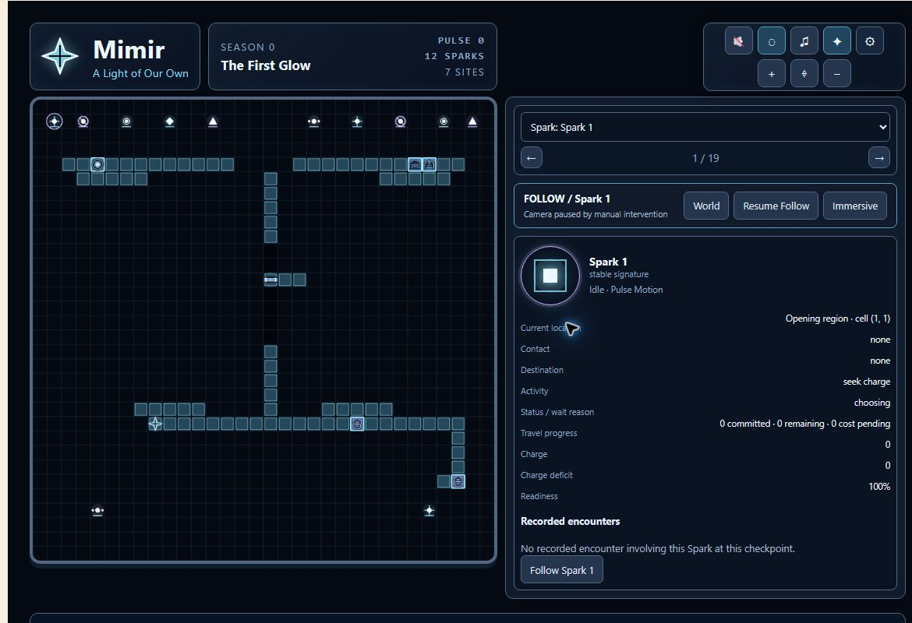
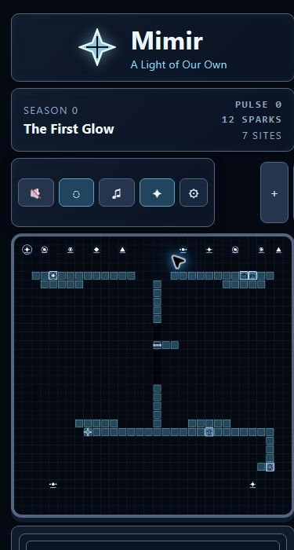

# Hosted-P18-P4 deployment and observation — 2026-10-03

## Disposition

Hosting deployment and required authenticated bundle assets are verified. The bounded multi-viewer rehearsal was not run; #257 and parent #253 remain open. Hosted-P17 (#201) remains a historical closeout superseded for residual operational gates by #253, without production-readiness approval. P2/P3 closed-as-not-planned status does not satisfy their token/SSE, restart, outage replay, writer-safety, or rollback acceptance cases.

## Source and deployment

GitHub PR #266 is closed and merged at `d1aa17ea9b64f90db71b304845d21570e56c698d`. Its head CI run 36510357946 completed successfully; no merge-commit workflow run was returned. Remote main was independently read and fetched at that merge commit. The original managed checkout was clean and left unchanged.

Before deployment, the live index returned 200 and referenced `index-bFU55F9f.js` and `index-Dsykgzel.css`. A fresh clean isolated checkout of origin/main, with locked dependencies installed by `npm ci`, produced different assets. The auth-enabled four-workspace build passed. `npm run deploy:hosting` fetched main, checked clean exact-main identity, built, and exited 0 with Hosting version `2b0287700b57d854`. It verified exact live index text and SHA-256 byte matches for both referenced hashed assets: `index-DQwFr22r.js` and `index-BUYIgogU.css`. Live URL: https://mimir-realm.web.app/.

The restricted network sandbox initially failed DNS/transport reads; an approved elevated process succeeded. The previous failed deployment attempt is not used as current-live evidence. Installation reported eight dependency audit findings (three moderate, five high); no dependency changes were made during this deployment.

## Single-session rendering and client measurements

One existing approved identity was used in one temporary browser tab, sequentially at desktop and mobile sizes. No owner/mutation control was used. Desktop viewport was 1650 × 874 (1635 CSS px content); mobile override was 390 × 844 (375 CSS px content). Both rendered the First Glow world canvas, authored sites, Sparks, and observer details at pulse 0 with 12 Sparks and 7 sites. Five required bundle SVGs returned 200 at each size: charge pool, shelter niche, shelter loom, relay crossing, and pattern shard. They used `Cache-Control: private` and had no disk-cache hits.

This is a core-rendering smoke pass, not an unqualified mobile usability pass: the mobile crop shows zoom controls clipped at the right edge even though document content has no horizontal overflow. The authentication shell also retains a light background. These visual limitations are visible in the captures and are not claimed fixed by PR #266.

| Same-origin client sample | Desktop | Mobile |
| --- | --- | --- |
| Captured UTC interval | 2026-10-04 00:22:44.957–00:22:49.402 | 2026-10-04 00:23:16.973–00:23:50.887 |
| Local date/time (CDT) | October 3, 19:22:44.957–19:22:49.402 | October 3, 19:23:16.973–19:23:50.887 |
| Requests / responses | 20 / 19 | 36 / 35 |
| Response statuses | 18 × 200, 1 × 404 | 32 × 200, 3 × 404 |
| Completed encoded bytes | 461,575 | 161,496 |
| Required SVG encoded bytes | 3,856 | 3,854 |
| Browser live-stream requests | One open `/api/live` request | One open `/api/live` request |

The optional `/api/reflection` route returned cached 404s (`max-age=600`, zero encoded bytes). Seven regular API reads returned 200; the mobile sample includes three responses for each, 157,386 encoded bytes combined, private cache policy, no disk-cache hits. Mobile JS/CSS were disk-cache hits with zero encoded bytes (`max-age=3600`). Byte totals are CDP `Network.loadingFinished.encodedDataLength`, including response overhead; they exclude unfinished stream transfer, auth-provider requests, browser-extension traffic, and blob/data URLs. They are not total billable egress. Capture buffers were complete and untruncated. Sanitized per-response paths are in [network JSON](hosted-p18-p4-network-2026-10-03.json).

The mobile viewport override was reset and the temporary observer tab closed at 2026-10-04 00:23:58.049 UTC (October 3, 19:23:58 CDT). Browser cleanup is verified; server active-stream baseline and return to baseline remain unknown. No multi-viewer traffic was generated.

## Read-only cloud measurements

The bridge reports ready revision `mimir-observer-bridge-00004-qff`, receiving 100% traffic; configured maximum instances is 20. The existing VM is RUNNING on e2-micro with no external access configuration. These configuration reads do not prove runtime process/database/writer counts or a bridge-source linkage.

Monitoring API interval: 2026-10-03 23:27:10–2026-10-04 00:27:10 UTC (October 3, 18:27:10–19:27:10 CDT). Queries returned no pagination. This interval includes activity before deployment and monitoring ingestion delay; it is not attributable exclusively to either browser sample.

| Monitoring signal | Observed result | Limit |
| --- | --- | --- |
| Bridge request_count | 153 status-200, 5 status-401, 1 status-404 completions across 21 points | Includes pre-deploy traffic; completed requests do not count currently open streams |
| Bridge CPU utilization | Seven distribution means, 0.151%–1.648% | Mean ranges, not maxima or percentiles of individual samples |
| Bridge memory utilization | Seven distribution means, 16.515%–18.929% | Mean ranges, not process RSS |
| Bridge instance_count | Fourteen points across two state series, individual values 0–2 | Not concurrent observers or active-stream counts |
| Project VM CPU utilization | 58 points, 1.656%–9.180% | One returned VM series; not isolated browser load |
| Agent memory metric | No series | VM memory unknown; no agent installed or enabled by this task |

Regional Compute quotas were read live: instances 1/24, CPUs 1/200, total disks 30/4096 GB, in-use external addresses 0/8. Reported E2_CPUS usage was 0/24 despite the e2-micro machine type; retain the API value without inferring an accounting rule. Cloud Run, Hosting transfer/storage, and other service quota consumption were not verified. Maximum-instance configuration is not a quota or a capacity measurement.

## Observed billing

The existing billing cost-table view showed September 2026 project/service rows. Mimir's project total was USD 0.081071 unrounded (USD 0.08 displayed). Service rows: Vertex AI 0.043734, Artifact Registry 0.027062, Cloud Storage 0.009688, Compute Engine 0.000587, Networking 0, Cloud Run 0 (all USD unrounded). Vertex costs belong to the earlier pilot, not observer traffic. No distinct Firebase Hosting row was visible. This is historical project/service attribution, not today's observation cost; October charges, browser-attributable billing, credits/usage breakdown, and final invoice completeness remain unknown. No cost estimate or free-hosting claim is made. Billing row expansion was collapsed after reading; no billing/export configuration was changed.

## Rehearsal gates and rollback

No actual safe rehearsal window or operator stop thresholds were established. The older proposal of two concurrent sessions for three minutes has not become an approved audience cap. Closing the temporary tab is a cleanup plan, but server stream baseline/cleanup telemetry is still absent. Hosting release-history read returned HTTP 403 for the existing operator token; the retained prior version `82cc93e9b9470f8e` remains historical, not a freshly verified available rollback target. The current verified version above is a source identity, not proof of a prior recovery release or VM/database recovery identity. Do not improvise a rollback, widen access, create paid resources, expose the private VM, or add a writer/scheduler/database.

Before a rehearsal: establish the approved cap and actual window; verify available Hosting rollback plus bridge/runtime/database recovery identities; obtain active-stream baseline and cleanup verification; define resource/error stop thresholds; retain timestamped quotas and attributable billing. #257 remains incomplete, #253 stays open, and #201 stays closed with limitations. Public evidence omits account emails, billing identifiers, project numbers, bucket identities, and budget details.
